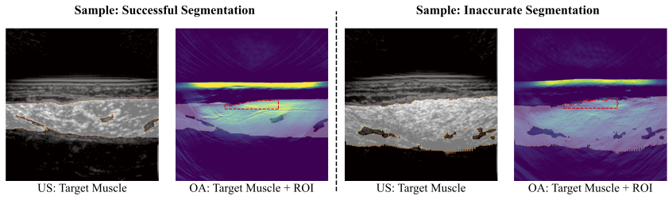
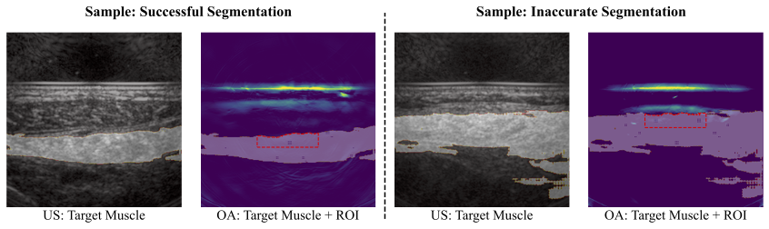
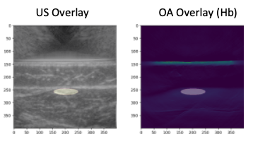
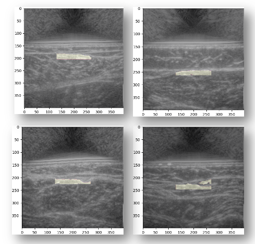

# Ultrasound Segmentation / MSOT Analysis Pipeline

Code of the project: **Automatic Muscle Segmentation for the Diagnosis of Peripheral Artery Disease Using Multispectral
Optoacoustic Tomography**

**Abstract:**

*Multispectral optoacoustic tomography (MSOT) is an imaging modality that visualizes chromophore concentrations, such as oxygenated and deoxygenated hemoglobin, aiding in the diagnosis of blood-perfusion-related
diseases like peripheral artery disease (PAD). Previous MSOT-based diagnostic studies involved experts manually
selecting a region of interest (ROI) with a predefined shape in the target muscle to analyze blood oxygenation.
This study automates this process using a deep-learning-based segmentation model applied to co-registered
ultrasound images.*

*Our pipeline automatically generates an ROI and places it in the MSOT image by segmenting the target
muscle in the ultrasound image. We evaluated its performance using two PAD-related datasets. Our automati-
cally generated ROIs achieved areas under the ROC curve (AUCs) of 0.87 and 0.76 at classifying PAD patients,
comparable to manually drawn ROIs by clinical experts. This approach could reduce annotation effort in future
MSOT studies while providing ROIs with greater physiological relevance.*


## Description

The pipeline can be configured in the `config.py` file. It contains a pipeline consisting of the following steps:
- Preprocessing: Loads the ultrasound images of all the specified scans from the src directory, resizes them to a given size, etc.
- Segmentation: Loads a pretrained model, performs some model specific preprocessing, predicts a segmentation mask for the muscle on the ultrasound images, exports the segmentation masks. Supports different segmentation algorithms (MedSAM, nnUNet). Can process images one by one or as batch (if supported by segmentation model).
- Postprocessing: Loads the segmentation masks, performs connected component analysis, keeps only the largest component, exports the postprocessed segmentation masks.
- ROI Placement: Loads the postprocessed segmentation masks, places an ROI into the segmented muscle, and exports the ROIs as masks or JSON. It supports elliptic ROIs as well as polygons. It takes into account the sensitivity of the scanner. Elliptic ROIs can be exported to iThera iLabs annotation format.
- Analysis: Loads the ROIs as JSONs or masks along with the OA scans, places ROIs onto the scans, and extracts the intensity in the ROI with the given metric (default is mean). It performs downstream analysis tasks like classifying subjects into healthy and PAD patients (if labels are given).

For the segmentation algorithms and the analysis tasks there are additional config files in the respective folders. Each step can be skipped by setting `enabled` to false in config (requires using fixed run_id), for example to only repeat the analysis step on a different chromophore.

Currently, there is no parallelization and each step writes out its processed files, which are then loaded by the next step. That is inefficient but easier for debugging and extracting intermediate results. If the mode is set to "DEBUG", each step also writes out its results as PNG.

  
### Sample Results

**Dataset A**



**Dataset B**




## Installation

- Clone the repository and install the project (conda env with python 3.10 recommended):
```
git clone git@gitos.rrze.fau.de:ec65ohyq/pad-seg-cl-pipeline.git
cd pad-seg-cl-pipeline
pip install -e .
```
- Choose the segmentation model:

- **nnUNet (default)**
    - Install nnunetv2 using
    ```
    pip install nnunetv2
    ```
    - a pretrained nnUNet model can be downloaded [here](https://faubox.rrze.uni-erlangen.de/getlink/fiQ3qAumS1RHgG2sQy5RGB/nnunet_5foldcv_trained.zip) (exported using nnUNetv2_export_model_to_zip command). 
    - Place the pretrained model weights into the `seg_cl_pipeline/components/segmentation/models/nnUNet/assets` folder (or adapt the path in the `model_config.py` file), dont unzip.
    - Set the model variable in the config file to "nnUNet" (default).

- **MedSAM**:
    - a pretrained MedSAM model can be downloaded [here](https://faubox.rrze.uni-erlangen.de/getlink/fi5yQ1Tpt16rSEB34sac8s/medsam_checkpoint_best_weights_only.pth). 
    - Place the pretrained model weights into the `seg_cl_pipeline/components/segmentation/models/MedSAM/assets` folder (or adapt the path in the `model_config.py` file).
    - set the model variable in the config file to "MedSAM".

## Usage

### Demo

We included two demo scans that can be used to test the pipeline. 
Simply start the pipeline using the CLI command or by executing the pipeline.py file:
```
run-pipeline
# or
python seg_cl_pipeline/pipeline.py
```

The resulting and intermediate files can be found in the data folder, under the individual timestamp. (Note that the classification result is meaningless, since it is based on optimal cutoff value, and the demo dataset only contains two scans).

### Reproduction

**Datasets:**

 For the project we used the datasets from [1](https://www.medrxiv.org/content/10.1101/2023.10.19.23297246v1) and [2](https://doi.org/10.1016/j.jcmg.2022.11.010). The datasets can be provided on request. 


- Place the dataset into the data folder (or adapt the path in the config.py file) and unzip.
- Adapt the config.py file if necessary.
- Adapt the seg_cl_pipeline/components/segmentation/models/model_config.py if necessary.
- Adapt the seg_cl_pipeline/components/analysis/analysis_config.py if necessary.

- Run the pipeline as described above.


## Model Training

This pipeline uses pretrained models and can only do inference. The model training can be found in the [US Segmentation Training Repository](https://github.com/Mo-Sc/us-segmentation).

## ROI Types

The pipeline currently supports two different ROI types:

### Elliptic ROIs

Most MSOT-based clinical studies, including [1](https://www.medrxiv.org/content/10.1101/2023.10.19.23297246v1) and [2](https://doi.org/10.1016/j.jcmg.2022.11.010), use elliptic ROIs for their simplicity and fast placement.



The elliptic ROIs are placed on the vertical axis, [margin] meters under the fascia. To use them, set the parameters in the `ROIPlacementConfig` class accordingly:
- `roi_type` to "ellipse".
- `roi_ellipse_size` is the width and height of the ellipse in m.
- `margin` is the vertical distance (in m) between the fascia and the ellipse.

### Complex ROIs

A better way to draw ROIs is using the structure of the fascia / muscle. This also allows us to exclude large vessels from the ROI, which might introduce a bias becasue of their high intensity.



To use these ROIs, set the parameters accordingly:
- `roi_type` to "polygon".
- `roi_height` is the height of the ROI (on the vertical axis) in m.
- `sensitivity_map` allows to specify a region outside of which the ROI cannot be placed and will therefore be clipped. This can be useful for diminishing sensitivity of the scanner deeper in the tissue [y_min, y_max, x_min, x_max] (in m).

The generated ROIs can be exported as JSON or iannotation (ithera ilabs) format by setting `json_export` and `iannotation_export`.


## Analysis Tools

The analysis step loads the ROIs from the ROI Placement step and extracts the intensities within these ROIs from the optoacoustic images. The intensities in the ROI can be summarized using different metrics ("mean", "median", "sum", "max"). `exclude_zeros` specifies whether zero values should be excluded from the calculation.

The extracted intensities can then be used for downstream tasks. Currently, only classification is implemented.

### PAD Classification

Classification requires a list of subjects IDs and the corresponding labels (healthy vs PAD). It then calculates accuracy and AUC by finding the optimal cutoff value to separate the groups. Further configuration options can be set in the `analysis_config.py` file.


